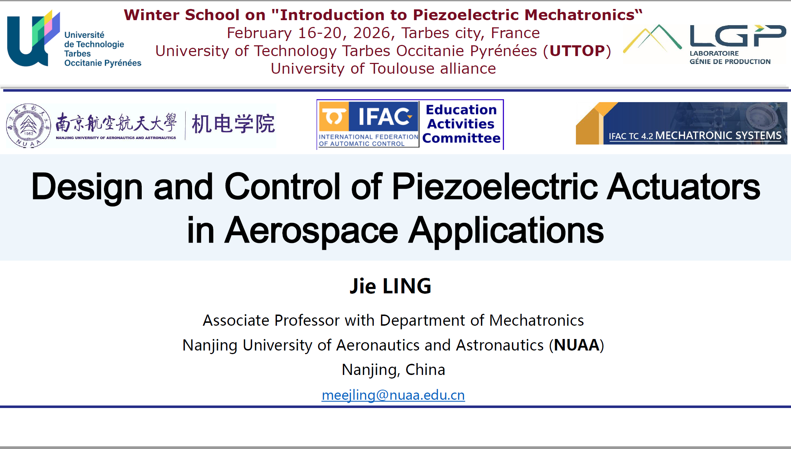
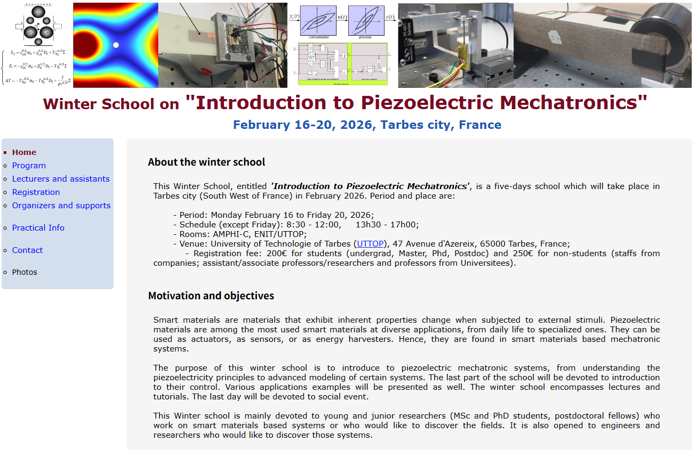
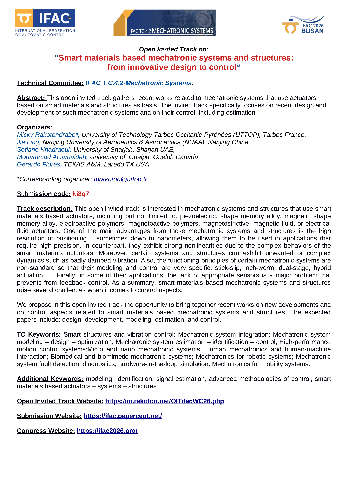
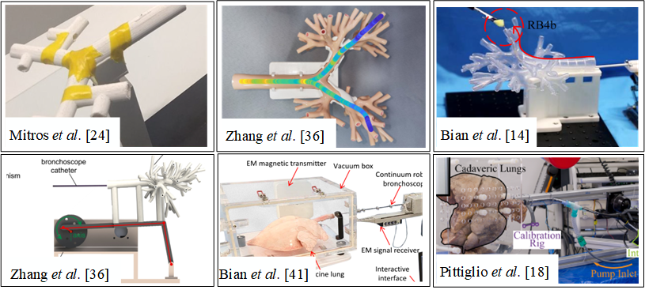
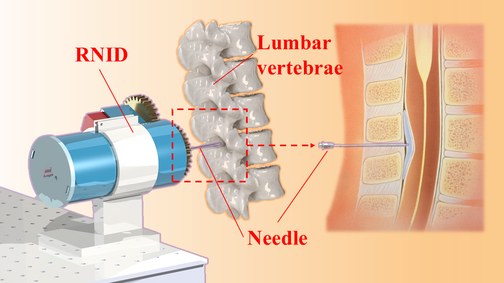
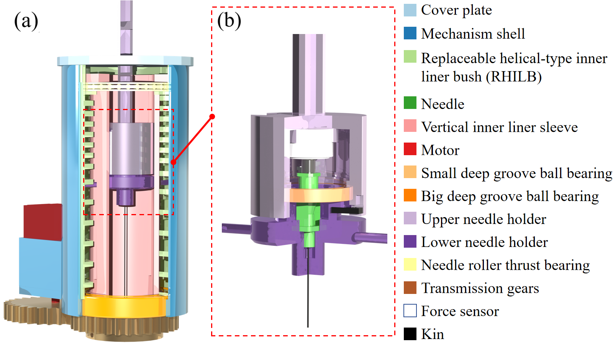
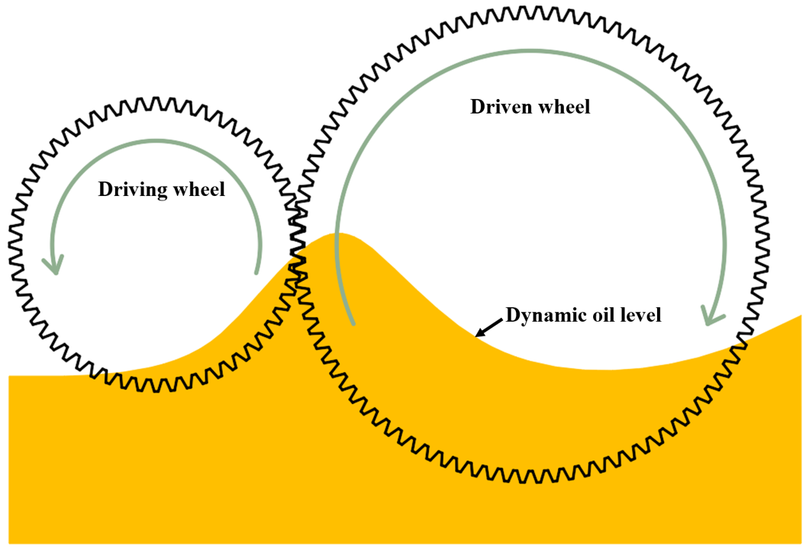
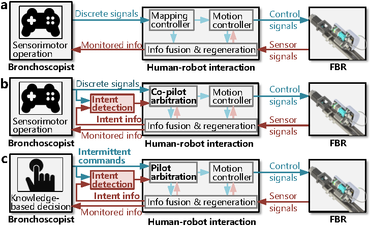
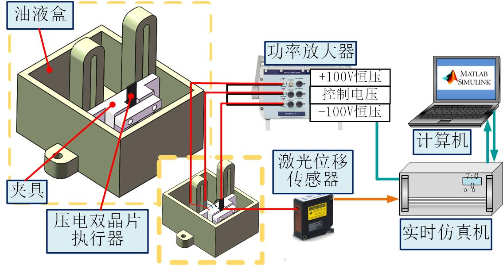
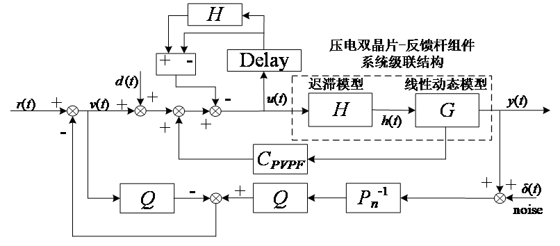

## Welcome to Jie LING's Home Page

<!-- 添加顶部导航栏 -->

  <a href="index.html">Home</a> |
  <a href="Detailed profile.html">Detailed profile</a> |
  <a href="projects.html">Projects</a> |
  <a href="teaching.html">Teaching</a> |
  <a href="publications.html">Publications</a> |
  <a href="students.html">Students</a> |
  <a href="contact.html">Contact</a>

<table border="0">
  <tr>
    <td width="75%">
      <h1>凌 杰 | Jie LING </h1>
      
<b>Associate Professor </b>

      
<b>Nanjing University of Aeronautics and Astronautics </b>

      
<b>Email: meejling@nuaa.edu.cn</b>

      
<b>Address: No.29, Yudao Street, Qinhuai District, Nanjing, China </b>

    </td>
     <td width="25%">
        
     </td>
    </tr>  
</table>

## 👨‍💼 BIO

I obtained my B.S. and Ph.D. in Mechanical Engineering from the School of Power and Mechanical Engineering, [Wuhan University (WHU)](https://en.whu.edu.cn/), China, in 2012 and 2018, respectively. During Aug. to Nov. in the year of 2017, I was a visiting Ph.D. student at the Department of Automatic Control and Micro-Mechatronic Systems, [FEMTO-ST Institute](https://www.femto-st.fr/en), France. From Jan. 2019 to Jan. 2020, I served as a Postdoctoral Research Fellow at the [Department of Biomedical Engineering, National University of Singapore (NUS)](https://cde.nus.edu.sg/bme/). From Dec. 2024 to Dec. 2025, I was a visiting scholar in Laboratoire Génie de Production, [University of Technologie Tarbes Occitanie Pyrénées (UTTOP)](https://www.uttop.fr/en/index.html), University of Toulouse alliance, France. Since August 2020, I have been an Associate Professor at the College of Mechanical and Electrical Engineering, [Nanjing University of Aeronautics and Astronautics (NUAA)](https://en.nuaa.edu.cn/) (Project 211 and the Double First-Class Construction University in China). From May. 2025, I have been selected as the Ph.D. Supervisor in NUAA.

---

**凌杰**，**副教授**、**博士生导师**，于2012年和2018年获得武汉大学机械电子工程工学学士和工学博士学位，2017年法国FEMTO-ST研究所访问博士生，2019年新加坡国立大学先进机器人中心Research Fellow，2020年入职南京航空航空大学机电学院，2025年法国图卢兹大学公派访问学者，入选江苏省“双创博士”、南京航空航天大学“长空学者”。从事医疗手术机器人、精密驱动与智能控制技术研究，主持国家自然科学基金、装备预研、江苏省重点研发计划课题、江苏省基金、航空科学基金、中国博士后基金等国家/省部级项目，以第一/通讯作者在IEEE TCST、IEEE TMECH、MSSP、MMT等机械电子领域知名期刊发表SCI论文30余篇，以第一发明人授权发明专利6项，获IEEE ICARM、IEEE FPM、IEEE ROBIO等多个国际学术会议论文奖。担任国际自动控制联合会（IFAC）机械电子分委会委员，SCI期刊Mechatronics客座编辑，国际学术会议IEEE ICARM 2023、ICIRA 2024、IFAC Mechatronics 2025等Associate Editor，IEEE会员、中国机械工程学会高级会员、中国生物医学工程学会会员，IEEE汇刊、机械工程学报等多个国内外学术期刊审稿人。

---

🔗 **Academic Profiles**  
- [🔬 ResearchGate](https://www.researchgate.net/profile/Jie-Ling-5)  
- [📊 Google Scholar](https://scholar.google.com.hk/citations?hl=zh-CN&user=HcqsRR4AAAAJ)  
- [🆔  ORCID](https://orcid.org/0000-0002-6786-0422)  

## 🔬 Research Interests  
**Medical Robotics**, **Smart Material Actuators**, **Intelligent Control**

  

---

## 📢 News

- **[2026-02-18]** 🌍 **Invited Winter School Talk**

-   I was honored to deliver a lecture titled "Design and Control of Piezoelectric Actuators in Aerospace Applications" at the Winter School on "Introduction to Piezoelectric Mechatronics" , organized by Prof. Micky Rakotondrabe at the University of Technology Tarbes Occitanie Pyrénées (UTTOP) , France. The talk introduced our recent research at NUAA on piezoelectric stack pumps for electro-hydrostatic actuators, bimorph actuators for high-speed servo valves, and distributed stack actuators with fault-tolerant control—topics addressing the aerospace demands for high power-to-weight ratio, fast response, and enhanced reliability. This visit also continued my long-term collaboration with French institutions, following my previous stays at FEMTO-ST Institute in 2017 and at UTTOP as a visiting scholar from 2024 to 2025. Grateful to Prof. Rakotondrabe for the invitation and to all the participants for the engaging discussions!

  

    
  

  
---

- **[2025-12-13]** 📢 **Winter School 2026 — Introduction to Piezoelectric Mechatronics**

  Prof. **Micky Rakotondrabe** is organizing a Winter School on *“Introduction to Piezoelectric Mechatronics”*, which will take place on **February 16–20, 2026** at the **University of Technology of Tarbes (UTTOP)**, Tarbes, France.  
  More information is available at: [http://rakoton.net/Schools/PiezoMechatronics/](http://rakoton.net/Schools/PiezoMechatronics/)

  This winter school aims to introduce piezoelectric mechatronic systems, from fundamental piezoelectric principles to advanced system modeling and control. The program includes lectures, tutorials, and application-oriented examples, with the final day dedicated to a social event.

  The school is mainly intended for MSc and PhD students, postdoctoral fellows, and young researchers working on or interested in smart material–based systems, especially piezoelectric systems. Engineers and researchers wishing to discover this field are also welcome.

  The registration process consists of two steps: **preregistration (currently open)** and registration payment.

  Please see the following page for the process: [http://rakoton.net/Schools/PiezoMechatronics/registration.php](http://rakoton.net/Schools/PiezoMechatronics/registration.php)
  
  Both preregistration and registration close on **February 1, 2026**. Winter School period: February 16-20, 2026.

  

    
  

  
---

- **[2025-09-19]** 📢 **Call for Papers**  
  🏆 IFAC WC 2026: Open Invited Track on *"Smart Materials-based Mechatronic Systems and Structures: From Innovative Design to Control"*.  
  🌍 More details can be found at Prof. [Micky Rakotondrabe's Homepage](https://m.rakoton.net/OITifacWC26.php) and the [IFAC WC 2026 Website](https://ifac2026.org/fairDash.do).  

  

---

- **[2025-08-27]** 🏆 Our research group has been granted a National Natural Science Foundation of China (NSFC) Youth Project titled "Research on a Distally Extensible Bronchoscopic Robot for Peripheral Lung Nodule Biopsy". The funding rate this year is 12.26%. Traditional bronchoscopes are limited by their structural size and turning ability, making it difficult to reach the peripheral lung for biopsy operations. This project aims to achieve innovation in structure, modeling theory, and control methods to develop an end-extensible bronchoscope robot for peripheral pulmonary nodule biopsy.
    

           
  
  
  
---  

- **[2025-08-22]** 🎉 A paper by an undergraduate student group has been **Accepted** for publication in [Journal of Mechanisms and Robotics](https://asmedigitalcollection.asme.org/mechanismsrobotics). This work was funded by College Students' Innovative Entrepreneurial Training Plan Program‌ in NUAA. Robotic-assisted lumbar puncture (LP) has demonstrated significant advantages over manual
procedures in terms of accuracy and repeatability, with robotic-assisted needle insertion devices (RNIDs) serving as the core component for accurate needle placement. This paper proposes a one degree of freedom (1-DOF) patient-specific RNID to enhance the insertion accuracy.
  

    <table>
      <tr>
        <td align="center">
          
        </td>
        <td align="center">
          
        </td>
      </tr>
    </table>
  
  
  
---  

- **[2025-08-06]** 🎉 Two papers by Master student **Ruifeng Zhao** have been **ACCEPTED** for publication in [MDPI Machines](https://www.mdpi.com/2075-1702/13/8/678) and ASME Journal of Tribology. The two papers focus on the CFD approaches for oil–air two-phase flow in high-speed lubricated rolling bearings and the quantitative analysis of gear churning loss in helicopter transmission lubrication systems, respectively.
  

    <table>
      <tr>
        <td align="center">
          
        </td>
        <td align="center">
          
        </td>
      </tr>
    </table>
  
  
  
---  

- **[2025-06-15]** 🎉 A review paper by PhD student **Yuzhou Duan** has been **ACCEPTED** for publication in [IEEE Transactions on Medical Robotics and Bionics (TMRB)](https://ieeexplore.ieee.org/xpl/RecentIssue.jsp?punumber=9039958).  
  

    <table>
      <tr>
        <td align="center">
          
        </td>
        <td align="center">
          
        </td>
      </tr>
    </table>
  
  
  
---  

- **[2025-05-26]** 🏆 课题组博士生**段榆洲**获南京航空航天大学“博士生学位论文创新与创优基金”资助.  

---

- **[2025-05-22]** 🎉 课题组硕士生**彭洪涛**两篇论文分别被《航空科学技术》、《航空动力学报》录用.
    

    <table>
      <tr>
        <td align="center">
          
        </td>
        <td align="center">
          
        </td>
      </tr>
    </table>
  
  

---
  
- **[2025-05-16]** 🎉 A paper by master student **Yunzhi Zhang** has been **ACCEPTED** for publication in **Mechatronics** as well as will be presented in IFAC Joint Symposia on Mechatronics & Robotics to be held in the beautiful city of Paris from July 15 to July 18, 2025.  

---

- **[2025-05-10]** 📚 A new international collaboration course **Academic Reading, Writing and Presentation Skills** with Prof. Micky Rakotondrabe from [UTTOP](https://www.uttop.fr/en/index.html) has been successfully launched.  

---

- **[2025-03-01]** 📝 Dr. Jie Ling has been invited as an **Associate Editor** for the upcoming special issue in [IFAC Mechatronics](https://www.ifac2025.org/) journal with presentation at IFAC Joint Symposia on Mechatronics & Robotics 2025 to be held in Paris.  

---

