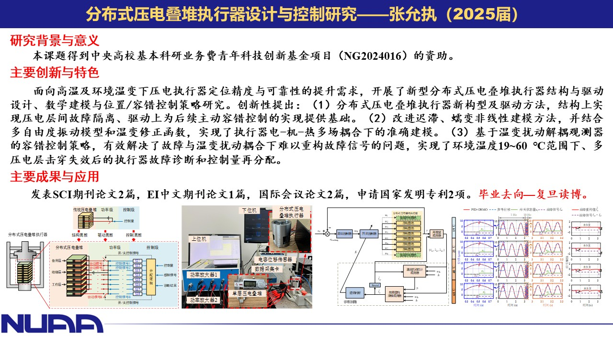
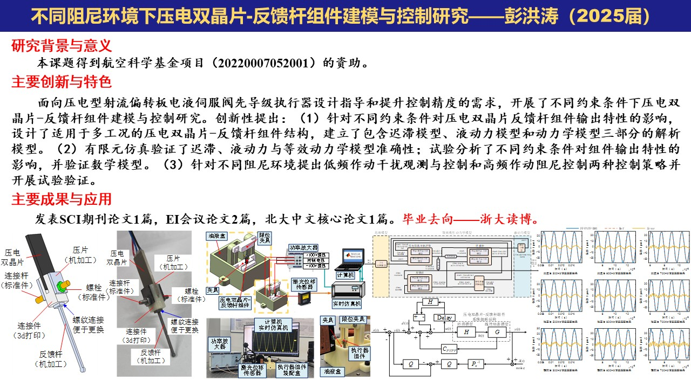

# Publication List

<!-- 添加顶部导航栏 -->

  <a href="index.html">Home</a> |
  <a href="Detailed profile.html">Detailed profile</a> |
  <a href="projects.html">Projects</a> |
  <a href="teaching.html">Teaching</a> |
  <a href="publications.html">Publications</a> |
  <a href="students.html">Students</a> |
  <a href="contact.html">Contact</a>

 
## 📄 Journal Papers (\* Corresponding author) / 期刊论文（*通讯作者）

### 🐎 2026（丙午马年）
[67] Ruifeng Zhao, **Jie Ling**\*, Pengfei Zhou, Jianfeng Zhong, and Duan Yang. [Analytical modeling and experimental validation of gear churning loss in helicopter transmission lubrication systems](https://asmedigitalcollection.asme.org/tribology/article-abstract/148/1/014601/1220950/Analytical-Modeling-and-Experimental-Validation-of?redirectedFrom=fulltext). **_Journal of Tribology_**. 2026, **148** (1): 014601.

### 🐍 2025（乙巳蛇年）

[66] Linfei Li, Yuwen Wang, Yuchaun Zhu\* and **Jie Ling**. [Research on backstepping adaptive sliding mode control of digital piezoelectric two-stage proportional valve](https://iopscience.iop.org/article/10.1088/1361-665X/ae0bd0). **Smart Materials and Structures**. 2025. **34**(10): 105022.

[65] Wenbo Jia, Teng Wang, Baohua Zhao, Wenzhuo Huang, Yuzhou Daun, Zuoqing Yu, and **Jie Ling**\*. [Design of a patient-specific needle insertion device based on RHILB for accurate and safe lumbar puncture](https://asmedigitalcollection.asme.org/mechanismsrobotics/article/doi/10.1115/1.4069673/1221945?casa_token=2ayLDYBEdLYAAAAA:RkI5rlgT2lpQsNBHyNmwQK4FIpfShtpx_V1WZv-4kq8F-1dOBpTIW6pMGMe-CCwl-1hSCurH). **_Journal of Mechanisms and Robotics_**. 2025, **17**(12): 121002.

[64] **凌杰**\*，彭洪涛，李蕴琪，张文星，康佳豪，朱玉川. 电液伺服阀压电双晶片力马达组件数学建模. **航空动力学报**. 2025. doi: 10.13224/j.cnki.jasp.20250241. (Accepted)

[63] Ruifeng Zhao, Pengfei Zhou, Jianfeng Zhong, Duan Yang, and **Jie Ling**\*. [A comparative investigation of CFD approaches for oil–air two-phase flow in high-speed lubricated rolling bearings](https://www.mdpi.com/2075-1702/13/8/678). **_Machines_**. 2025. **13**(8): 678.

[62] Yuzhou Duan, **Jie Ling**\*, Micky Rakotondrabe, Zuoqing Yu, Lei Zhang and Yuchuan Zhu\*. [A review of flexible bronchoscope robots for peripheral pulmonary nodule intervention](https://ieeexplore.ieee.org/document/11051056). **_IEEE Transactions on Medical Robotics and Bionics (TMRB)_**. 2025. **7**(3): 845-862.

[61] 彭洪涛，张允执，**凌杰**\*，张文星，康佳豪，朱玉川. 油液环境下的压电双晶片执行器数学建模与试验分析. **航空科学技术**. 2025. **36**(11): 41-47.

[60] 彭洪涛，张允执，**凌杰**\*，张文星，康佳豪，朱玉川. 油液环境下的电液伺服阀用压电双晶片执行器复合阻尼控制. **航空动力学报**. 2025. doi: 10.13224/j.cnki.jasp.20250108. (Accepted)

[59] Yunzhi Zhang, **Jie Ling**\*, Micky Rakotondrabe, Yuchuan Zhu, and Dan Wang. [Modeling and feedforward control of hysteresis in piezoelectric actuators considering its rotation and expansion](https://www.sciencedirect.com/science/article/abs/pii/S0957415825000637). **_Mechatronics_**. 2025. **110**: 103354.

[58] Yuzhou Duan, **Jie Ling**\*, Micky Rakotondrabe, and Yuchuan Zhu\*. [Achieving high-speed smooth motion for stick-slip piezoelectric motors with impact-enhanced driving mode](https://iopscience.iop.org/article/10.1088/1361-665X/adcd34/meta). **_Smart Materials and Structures_**. 2025. **34**(4): 045022

[57] 彭洪涛，**凌杰**\*，朱玉川，李成刚. [基于J-A模型的压电双晶片执行器非线性建模及验证](http://peaotec.ijournals.cn:8001/ydysg823/article/abstract/20250123?st=search). **压电与声光**. 2025. **47**(1): 142-147. 

[56] **凌杰**\*，张允执，陈龙，朱玉川．[数字压电叠堆执行器：原理、建模与控制](https://link.cnki.net/urlid/42.1294.TH.20240531.1807.002.)．**中国机械工程**. 2025. **36**(2): 228-237.

[55] Tingting Ye, Zhao Feng, **Jie Ling**, Yangmin Li\*. [A novel W-shaped flexure-guided mechanism for high-frequency piezo-actuated micromanipulations](https://ieeexplore.ieee.org/abstract/document/10734177). **_IEEE/ASME Transactions on Mechatronics_**. 2025. **30**(5): 3781-3791.

### 🐲 2024（甲辰龙年）

[54] Yunzhi Zhang, **Jie Ling**\*, and Yuchuan Zhu. [Development and fault-tolerant control of a distributed piezoelectric stack actuator](https://iopscience.iop.org/article/10.1088/1361-665X/ad669e/meta). **_Smart Materials and Structures_**. 2024. **33**(9): 095003.

[53] Yuzhou Duan, **Jie Ling**\*, and Yuchuan Zhu\*. [Modeling and admittance control of a piezoactuated needle insertion device for safe puncture of spinal membranes](https://asmedigitalcollection.asme.org/medicaldevices/article/18/3/034501/1201723). **_Journal of Medical Devices_**. 2024. **18**(3): 034501. 

[52] Yuzhou Duan, **Jie Ling**\*, Zhao Feng, Tingting Ye, Tairen Sun, and Yuchuan Zhu. [A survey of needle steering approaches in minimally invasive surgery](https://link.springer.com/article/10.1007/s10439-024-03494-0). **_Annals of Biomedical Engineering_**. 2024. **52**: 1492–1517.

[51] Yuzhou Duan, **Jie Ling**\*, Zhao Feng, Daojin Yao, Yuchuan Zhu. [Development of a base-actuated three-rhombus configured remote center of motion mechanism for lumbar puncture](https://asmedigitalcollection.asme.org/mechanismsrobotics/article/16/5/054503/1164054). **_Journal of Mechanisms and Robotics_**. 2024. **16**(5): 054503.

[50]  **Jie Ling**\*, Hongtao Peng, Yuzhou Duan, and Micky Rakotondrabe. [Reducing backward motion of stick-slip piezoelectric actuators using dual driving feet designed by asymmetric stiffness principle](https://www.sciencedirect.com/science/article/pii/S0094114X24002374). **_Mechanism and Machine Theory_**. 2024. **203**:105810.

[49] Dongdong Zheng, Yangkun Zhang, **Jie Ling**, Haoyong Yu\*, and Xuemei Ren. [Composite learning based adaptive terminal sliding mode control for nonlinear systems with experimental validation](Composite learning based adaptive terminal sliding mode control for nonlinear systems with experimental validation). **_IEEE Transactions on Industrial Electronics_**. 2025. **72**(8): 8197-8207.

[48] Xiaoming Chen, Yuchuan Zhu\*, **Jie Ling**, and Mingming Zhang. [Characteristic investigation of digital control four quadrant electro-hydrostatic actuator with separated hydraulic motor](https://pubs.aip.org/aip/rsi/article-abstract/95/9/095002/3311771/Characteristic-investigation-of-digital-control?redirectedFrom=fulltext). **_Review of Scientific Instruments_**. 2024.**95**:095002.

[47] Mingming Zhang, Yuchuan Zhu\*, Linfei Li, and **Jie Ling**. [Dynamic modeling of a cantilever reed valve considering squeeze flow with experimental validation](https://pubs.aip.org/aip/pof/article-abstract/36/6/067131/3299243/Dynamic-modeling-of-a-cantilever-reed-valve?redirectedFrom=fulltext). **_Physics of Fluids_**. 2024. **36**(6): 067131.

[46] Yanwen Wang, Yuchuan Zhu\*, Long Chen, **Jie Ling**, and Mingming Zhang. [Development and testing of a discrete coil magnetostrictive actuator](https://iopscience.iop.org/article/10.1088/1361-665X/ad6382/meta). **_Smart Materials and Structures_**. 2024, **33**(9): 095001.

[45] 王玉文，朱玉川\*，**凌杰**，陈晓明，张洺铭. [滑阀式压电高速开关阀特性研究](http://www.jasp.com.cn/hkdlxb/article/doi/10.13224/j.cnki.jasp.20220426). **航空动力学报**. 2024. **39**(11): 20220426.

[44] Yitong Li, Tingting Ye, **Jie Ling**, Xiaohui Xiao, and Zhao Feng\*. [A novel F-shaped linear guiding mechanism based compliant positioning stage with restricted parasitic motion](https://www.sciencedirect.com/science/article/pii/S0141635924000783). **_Precision Engineering_**. 2024. **88**:674-685.

[43] Mingming Zhang, Yuchuan Zhu\*, Shenghong Ge, and **Jie Ling**. [Development of a large flow electro-hydrostatic actuator equipped with four magnetostrictive-actuated pumps](https://pubs.aip.org/aip/rsi/article-abstract/95/1/015005/3104345/Development-of-a-large-flow-electro-hydrostatic?redirectedFrom=fulltext). **_Review of Scientific Instruments_**. 2024. **95**(1): 95, 015005.

[42] Zhicheng Song, Linkang Wang, **Jie Ling**, Lingyu Wang, Jinjun Duan, Yaoyao Wang\*, and Bai Chen. [Time-delay control scheme with adaptive fixed-time convergent super-twisting fractional-order nonsingular terminal sliding mode for piezoelectric displacement amplifier](https://www.sciencedirect.com/science/article/pii/S0019057823005645). **_ISA Transactions_**. 2024. **146**:99-113.

### 🐰 2023（癸卯兔年）

[41] Long Chen, Yuchuan Zhu\*, **Jie Ling**, and Mingming Zhang. [Temperature dependence modeling and experimental evaluation of a multidimensional discrete magnetostrictive actuator](https://www.sciencedirect.com/science/article/pii/S1359431123007652). **_Applied Thermal Engineering_**. 2023. **230**(Part B): 120736. 

[40] **Jie Ling**\*, Zhao Feng, Long Chen, Yuchuan Zhu, Yongping Pan. [Neural network-based iterative learning control of a piezo-driven nanopositioning stage](https://www.sciencedirect.com/science/article/abs/pii/S0141635923000338). **_Precision Engineering_**. 2023, **81**:112-123. 

[39] **Jie Ling**, Long Chen, Mingming Zhang, and Yuchuan Zhu*. [Development of a dual-mode electro-hydrostatic actuator with serial-parallel hybrid configured piezoelectric pumps](https://iopscience.iop.org/article/10.1088/1361-665X/acafb5/meta). **_Smart Materials and Structures_**. 2023, **32**(2): 025011.

[38] 陈晓明，朱玉川\*，**凌杰**，郑述峰，王玉文. [旋转惯性液压变换器的能效特性研究](https://bhxb.buaa.edu.cn/bhzk/cn/article/doi/10.13700/j.bh.1001-5965.2021.0570). **北京航空航天大学学报**. 2023. **49**(08):1982-1990.

[37] 郑述峰，朱玉川\*，**凌杰**，刘昶，林文. [轴向双压电叠堆执行器并联控制实验研究](https://bhxb.buaa.edu.cn/bhzk/cn/article/doi/10.13700/j.bh.1001-5965.2021.0432). **北京航空航天大学学报**. 2023. **49**(06):1460-1470. 

### 🐯 2022（壬寅虎年）

[36] Zhao Feng, Wenyu Liang\*, **Jie Ling**, Xiaohui Xiao\*, Kok Kiong Tan, and Tong Heng Lee. [Precision force tracking control of a surgical device interacting with a deformable object](https://ieeexplore.ieee.org/abstract/document/9794483). **_IEEE/ASME Transactions on Mechatronics_**. 2022. **27**(6): 5327-5338.

[35] Lingkang Meng, Yuchuan Zhu\*, **Jie Ling**, Jianjun Ding, Zhichuang Chen, and Xiaoming Chen. [Research on mathematical modeling of the servo valve torque motor considering the variation of working air-gaps leakage flux](https://journals.sagepub.com/doi/abs/10.1177/09544062211064971). **_Proceedings of the Institution of Mechanical Engineers, Part C: Journal of Mechanical Engineering Science_**, 2022. **236**(11): 09544062211064971.

[34] Xiaoming Chen, Yuchuan Zhu\*, Travis Wiens, Doug Bitner, **Jie Ling**. [Characteristic investigation of a flow-dependent inertia hydraulic converter driven by an equivalent fast switching valve](https://journals.sagepub.com/doi/abs/10.1177/09544062211038983). **_Proceedings of the Institution of Mechanical Engineers, Part C: Journal of Mechanical Engineering Science_**, 2022. **236**(7): 3354-3374. 

[33] Zhao Feng, Wenyu Liang*, **Jie Ling**, Xiaohui Xiao\*, Kok Kiong Tan, and Tong Heng Lee. [Adaptive robust impedance control for an ear surgical device with soft interaction](https://ieeexplore.ieee.org/abstract/document/9447937/). **_IEEE/ASME Transactions on Mechatronics_**. 2022. **27**(3): 1784-1795. 

[32] **Jie Ling**\*, Long Chen, Zhao Feng, and Yuchuan Zhu. [Development and test of a high speed pusher-type inchworm piezoelectric actuator with asymmetric driving and clamping configuration](https://www.sciencedirect.com/science/article/abs/pii/S0094114X22002488). **_Mechanism and Machine Theory_**. 2022. **176**: 104997. 

[31] **Jie Ling**\*, Tingting Ye, Zhao Feng, Yuchuan Zhu, Yangmin Li, Xiaohui Xiao. [A survey on synthesis of compliant constant force/torque mechanisms](https://www.sciencedirect.com/science/article/abs/pii/S0094114X22002257). **_Mechanism and Machine Theory_**. 2022,. **176**: 104970. 

[30] Long Chen, Yuchuan Zhu\*, **Jie Ling**\*, Mingming Zhang. [Development and characteristic investigation of a multi-dimensional discrete magnetostrictive actuator](https://ieeexplore.ieee.org/abstract/document/9778278). **_IEEE/ASME Transactions on Mechatronics_**. 2022. **27**(4): 2071-2079.

[29] Long Chen, Yuchuan Zhu\*, **Jie Ling**\* and Zhao Feng. [Theoretical modeling and experimental evaluation of amagnetostrictive actuator with radial-nested stacked configuration](https://link.springer.com/article/10.1007/s11071-022-07494-4). **_Nonlinear Dynamics_**. 2022. **109**: 1277-1293. 

[28] Zhao Feng, Min Ming, **Jie Ling**\*, Xiaohui Xiao, Zhixin Yang, and Feng Wan\*. [Fractional delay filter based repetitive control for precision tracking: design and application to a piezoelectric nanopositioning stage](https://www.sciencedirect.com/science/article/abs/pii/S088832702100618X). **_Mechanical Systems and Signal Processing_**. 2022. **164**: 108249. 

### 🐮 2021（辛丑牛年）

[27] Long Chen, Yuchuan Zhu*, **Jie Ling**\* and Zhao Feng. [Development and test of a two-dimensional stacked terfenol-d actuator with high bandwidth and large stroke](https://ieeexplore.ieee.org/abstract/document/9431718/). **_IEEE/ASME Transactions on Mechatronics_**. 2021. **26**(4): 1951-1959. 

[26] Yingting Ye, **Jie Ling**\*, Xi Kang, Zhao Feng, and Xiaohui Xiao. [A novel two-stage constant force compliant microgripper](https://asmedigitalcollection.asme.org/mechanicaldesign/article-abstract/143/5/053302/1086524/A-Novel-Two-Stage-Constant-Force-Compliant). **_Journal of Mechanical Design_**. 2021. **143**(5): 053302. 

[25] **Jie Ling**, Zhao Feng, Xi Kang, and Xiaohui Xiao\*. [Bandwidth enhancement in damping control for piezoelectric nanopositioning stages with load uncertainty: Design and implementation](https://journals.sagepub.com/doi/abs/10.1177/1077546320941705). **_Journal of Vibration and Control_**. 2021. **27**(11-12):1382-1394. 

[24] Cancheng Qiu, **Jie Ling**\*, Yangkun Zhang, Min Ming, Zhao Feng and Xiaohui Xiao. [A novel cooperative compensation method to compensate for return stroke of stick-slip piezoelectric actuators](https://www.sciencedirect.com/science/article/abs/pii/S0094114X21000124). **_Mechanism and Machine Theory_**. 2021. **159**: 104254. 

[23] Min Ming, Wenyu Liang, Zhao Feng, **Jie Ling**, Abdullah Al Mamun, and Xiaohui Xiao\*. [PID-type sliding mode-based adaptive motion control of a 2-dof piezoelectric ultrasonic motor driven stage](https://www.sciencedirect.com/science/article/abs/pii/S0957415821000428). **_Mechatronics_**. 2021. **76**: 102543. 

### 🐭 2020（庚子鼠年）

[22] Like Cao, **Jie Ling**, Xiaohui Xiao\*. [Study on the influence of image noise on monocular feature-based visual SLAM based on FFDNet](https://www.mdpi.com/1424-8220/20/17/4922). **_Sensors_**. 2020. **20**: 4922. 

[21] Zhao Feng, Wenyu Liang\*, **Jie Ling**, Xiaohui Xiao\*, Kok Kiong Tan, and Tong Heng Lee. [Integral terminal sliding-mode-based adaptive integral backstepping control for precision motion of a piezoelectric ultrasonic motor](https://www.sciencedirect.com/science/article/abs/pii/S0888327020302429), **_Mechanical Systems and Signal Processing_**. 2020. **144**: 106856. 

[20] Like Cao, **Jie Ling**, and Xiaohui Xiao\*. [The WHU rolling shutter visual-inertial dataset](https://ieeexplore.ieee.org/abstract/document/9027901). **_IEEE Access_**. 2020. **8**(1): 50771-50779. 

[19] Min Ming, Zhao Feng, **Jie Ling**, and Xiaohui Xiao\*. [Disturbance observer-based model prediction control with real-time modified reference for a piezo-actuated nanopositioning stage](https://journals.sagepub.com/doi/abs/10.1177/0142331219878048). **_Transactions of the Institute of Measurement and Control_**. 2020. **42**(4): 813-822. 

[18] **Jie Ling**\*, Zhao Feng, Dongdong Zheng, Jun Yang, Haoyong Yu\*, and Xiaohui Xiao. [Robust adaptive motion tracking of piezoelectric actuated stages using online neural-network-based sliding mode control](https://www.sciencedirect.com/science/article/abs/pii/S088832702030621X). **_Mechanical Systems and Signal Processing_**. 2020. **150**: 107235. 

[17] Zhao Feng, **Jie Ling**\*, Min Ming, Wenyu Liang, Kok Kiong Tan and Xiaohui Xiao\*. [Signal-transformation-based repetitive control of spiral trajectory for piezoelectric nanopositioning stages](https://ieeexplore.ieee.org/abstract/document/9042220). **_IEEE/ASME Transactions on Mechatronics_**. 2020. **25**(3): 1634-1645. 

[16] **Jie Ling**, Zhao Feng, Min Ming, Zhao Guo, and Xiaohui Xiao\*. [Signal transformed internal model control for non-raster scanning of piezo-actuated nanopositioning stages](https://link.springer.com/article/10.1007/s12555-019-0064-y). **_International Journal of Control, Automation and Systems_**. 2020. **18**(8): 1915–1925. 

[15] **Jie Ling**, Micky Rakotondrabe, Zhao Feng, Min Ming and Xiaohui Xiao\*. [A robust resonant controller for high-speed scanning of nanopositioners: Design and implementation](https://ieeexplore.ieee.org/abstract/document/8658162/). **_IEEE Transactions on Control Systems Technology_**. 2020, **28**(3): 1116-1123.

### 🐷 2019 （己亥猪年）and before

[14] Zhao Feng, **Jie Ling**, Min Ming, and Xiaohui Xiao\*. [Integrated modified repetitive control with disturbance observer of piezoelectric nanopositioning stages for high-speed and precision motion](https://asmedigitalcollection.asme.org/dynamicsystems/article-abstract/141/8/081006/726541/Integrated-Modified-Repetitive-Control-With). **_Journal of Dynamic Systems Measurement and Control-Transactions of the ASME_**. 2019. **141**(8): 081006-081006-10. 

[13] Xiao Gao, **Jie Ling**, Xiaohui Xiao\*, and Miao Li\*. [Learning force-relevant skills from human demonstration](https://www.hindawi.com/journals/complexity/2019/5262859/). **_Complexity_**. 2019. **2019**: 5262859-5262859-11. 

[12] Zhao Guo, Jiantao Sun, **Jie Ling**, Yongping Pan\*, Tairen Sun, and Xiaohui Xiao, [Robust trajectory tracking control for variable stiffness actuators with model perturbations](https://www.frontiersin.org/articles/10.3389/fnbot.2019.00035/full). **_Frontiers in Neurorobotics_**. 2019. **13**: 35. doi: 10.3389/fnbot.2019.00035. 

[11] **Jie Ling**, Zhao Feng, Min Ming, and Xiaohui Xiao\*. [Model reference adaptive damping control for a nanopositioning stage with load uncertainties](https://aip.scitation.org/doi/abs/10.1063/1.5064722). **_Review of Scientific Instruments_**. 2019. **90**(4): 045101. 

[10] Zhao Feng, **Jie Ling**, Min Ming, and Xiaohui Xiao\*. [A model-data integrated iterative learning controller for flexible tracking with application to a piezo nanopositioner](https://journals.sagepub.com/doi/abs/10.1177/0142331217719958). **_Transactions of the Institute of Measurement and Control_**. 2018. **40**(10):3201-3210. 

[9] 冯朝,**凌杰**,明敏,肖晓晖\*. [融合迭代学习与干扰观测器的压电微动平台精密运动控制](http://www.cqvip.com/qk/90986x/20186/74818282504849564854484855.html). **机器人**. 2018. **40**(6): 825-834. 

[8] Min Ming, Zhao Feng, **Jie Ling**, and Xiaohui Xiao\*. [Hysteresis modeling and feedforward compensation of piezoelectric nanopositioning stage with a modified Bouc-Wen model](https://ietresearch.onlinelibrary.wiley.com/doi/full/10.1049/mnl.2017.0793). **_Micro & Nano Letters_**. 2018. **13**(8): 1170-1174. 

[7] Min Ming, **Jie Ling**, Zhao Feng, and Xiaohui Xiao\*. [A model prediction control design for inverse multiplicative structure based feedforward hysteresis compensation of a piezo nanopositioning stage](https://link.springer.com/article/10.1007/s12541-018-0197-6). **_International Journal of Precision Engineering and Manufacturing_**. 2018. **19**(11): 1699-1708.

[6] **Jie Ling**, Zhao Feng, Daojin Yao, and Xiaohui Xiao\*. [Non-linear contour tracking using feedback PID and feedforward position domain cross-coupled iterative learning control](https://journals.sagepub.com/doi/abs/10.1177/0142331217695386). **_Transactions of the Institute of Measurement and Control_**. 2018. **40**(6): 1970-1982. 

[5] **Jie Ling**, Zhao Feng, Min Ming, and Xiaohui Xiao\*. [Damping controller design for nanopositioners: a hybrid reference model matching and virtual reference feedback tuning approach](https://link.springer.com/article/10.1007/s12541-018-0002-6). **_International Journal of Precision Engineering and Manufacturing_**. 2018. **19**(1): 13-22. 

[4] **Jie Ling**, Zhao Feng, Daojin Yao, and Xiaohui Xiao\*. [Precision contour tracking using feedback-feedforward integrated control for a 2-DOF manipulation system](https://www.actapress.com/Abstract.aspx?paperId=45793). **_International Journal of Robotics & Automation_**. 2018. **33**(3):  276-283. 

[3] Zhao Feng, **Jie Ling**, Min Ming, and Xiaohui Xiao\*. [High-bandwidth and flexible tracking control for precision motion with application to a piezo nanopositioner](https://aip.scitation.org/doi/abs/10.1063/1.4998303). **_Review of Scientific Instruments_**. 2017. **88**(8): 085107.

[2] Zhao Feng, **Jie Ling**, Min Ming, and Xiaohui Xiao\*. [Data-based double-feedforward controller design for a coupled parallel piezo nanopositioning stage](https://journals.sagepub.com/doi/abs/10.1177/0959651817732502). **_Proceedings of the Institution of Mechanical Engineers, Part I - Journal of Systems and Control Engineering_**. 2017. **231**(10): 881-892.

[1] **凌杰**, 明敏, 冯朝, 肖晓晖\*. [多轴运动系统非线性轮廓重复跟踪的主从交叉耦合迭代学习控制](http://www.aas.net.cn/fileZDHXB/journal/article/zdhxb/2017/12/PDF/zdhxb-43-12-2127.pdf). **自动化学报**. 2017. **43**(12): 2127-2140.

---

## 📑 Conference Papers / 会议论文

[27] Yunqi Li, Mohamed Kouki\*, Micky Rakotondrabe, and **Jie Ling**. Three-stage energy management of microgrid under uncertainties. The 2nd International Conference on Electrical and Computer Engineering Researches (ICECER 2025). 6-8 December 2025, Antananarivo, Madagascar.

[26] Zuoqing Yu, Yuzhou Duan, Lei Zhang, and **Jie Ling**\*. [A patient-mounted spherical scissor-like remote center of motion mechanism for robotic-assisted lumbar puncture](https://link.springer.com/chapter/10.1007/978-981-96-0777-8_9). _17th International Conference on Intelligent Robotics and Applications (ICIRA 2024)_. 31st Jul.~ 2nd Aug, Xi’an, China, 2024.
 
[25] Yunzhi Zhang, Micky Rakotondrabe, Zhao Feng, Yuchuan Zhu, and **Jie Ling**\*. [Position servo control strategy for a hydraulic valve-controlled cylinder with a digital piezo-actuator.](https://ieeexplore.ieee.org/abstract/document/10644875) _The American Control Conference (ACC 2024)_. July 8-12, Toronto, Canada. 2024.

[24] Wenbo Jia, Zijia Zhao, Wenzhuo Huang, Yangyang Li, **Jie Ling**, Bai Chen, Yayi Shen\*. [Snake-inspired swarm robot design for distributed underwater search and rescue.](https://ieeexplore.ieee.org/abstract/document/10354836) _The 2023 IEEE International Conference on Robotics and Biomimetics (IEEE ROBIO 2023)_. Dec. 4-9, Samui, Thailand. 2023.

[23] Yuzhou Duan, Hongtao Peng, Yuchuan Zhu, Yayi Shen, **Jie Ling**\*. [Inertial piezoelectric actuation of a needle insertion device for minimally invasive surgery.](https://ieeexplore.ieee.org/abstract/document/10354709) _The 2023 IEEE International Conference on Robotics and Biomimetics (IEEE ROBIO 2023)_. Dec. 4-9, Samui, Thailand. 2023. **(Best Conference Paper Finalist)**

[22] Long Chen, Yuchuan Zhu\*, **Jie Ling**. [Development and characteristic analysis of a double spool nested fuel valve.](https://ieeexplore.ieee.org/abstract/document/10565525) _The 9th International Conference on Fluid Power and Mechatronics_. Aug. 18-21, Lanzhou, China. 2023.

[21] Mingming Zhang, Yuchuan Zhu\*, **Jie Ling**, and Xin Jiang. [Position servo control for dual piezoelectric pumps-based electro-hydrostatic actuator with active rectification valve.](https://ieeexplore.ieee.org/abstract/document/10565509) _The 9th International Conference on Fluid Power and Mechatronics_. Aug. 18-21, Lanzhou, China. 2023. (Best Paper, First Prize)

[20] Yitong Li, Tingting Ye, **Jie Ling**, Xiaohui Xiao, Zhao Feng\*. [Design, optimization and analysis of a novel compliant guiding mechanism for piezo-driven vibration microinjection.](https://ieeexplore.ieee.org/abstract/document/10218809) _2023 IEEE International Conference on Advanced Robotics and Mechatronics (ICARM 2023)_. Jul. 8-10, Sanya, China, 2023. **(Best Student Paper Finalist)**

[19] Zhicheng Song, Ziyu Liao, Linkang Wang, Hongtao Wu\*, **Jie Ling**. [A novel fractional-order adaptive gain fixed-time convergent super-twisting-algorithm.](https://ieeexplore.ieee.org/abstract/document/10218839) _2023 IEEE International Conference on Advanced Robotics and Mechatronics (ICARM 2023)_. Jul. 8-10, Sanya, China, 2023.

[18] Yunzhi Zhang, **Jie Ling**\*, Zhao Feng, Yuchuan Zhu. [A Comparison of Hysteresis Models with the Hammerstein Structure for Piezoelectric Actuators.](https://ieeexplore.ieee.org/abstract/document/10218900) _2023 IEEE International Conference on Advanced Robotics and Mechatronics (ICARM 2023)_. Jul. 8-10, Sanya, China, 2023. 

[17] Yuzhou Duan, Yunzhi Zhang, Yayi Shen, **Jie Ling**\*, and Yuchuan Zhu. [A three-rhombus configured remote center of motion mechanism for robot-assisted surgery.](https://ieeexplore.ieee.org/abstract/document/10023817) _37th Youth Academic Annual Conference of Chinese Association of Automation (YAC)_. May 27-29, Beijing, China, 2022.

[16] Yuzhou Duan, Yunzhi Zhang, **Jie Ling**\*, Zhao Feng, and Yuchuan Zhu. [A hub-type compliant piezo drill for cell microinjection.](https://ieeexplore.ieee.org/abstract/document/9959356) _7th IEEE International Conference on Advanced Robotics and Mechatronics (ARM’22)_. July 9-11, Guilin, China, 2022. 

[15] Zhao Feng, **Jie Ling**\*, Yayi Shen. [Discrete-time integral terminal sliding mode based repetitive control for periodic motion tracking.](https://ieeexplore.ieee.org/abstract/document/9858381) _IEEE 11th Data Driven Control and Learning Systems Conference (DDCLS’22)_. May 13-15, Emeishan, China, 2022. 

[14] Dongdong Zheng, **Jie Ling**, Xuemei Ren\*. Closed-loop distributed data-driven modeling and control for islanded microgrids. _The 33rd Chinese Control and Decision Conference (CCDC 2021)_. May 22-24, Kunming, China, 2021. (Poster)

[13] Zhao Feng, **Jie Ling**\*, Feng Wan, Zhixin Yang. [Iterative learning enhanced integral terminal sliding mode control for precision motion systems](https://ieeexplore.ieee.org/abstract/document/9455576). _IEEE 10th Data Driven Control and Learning Systems Conference (DDCLS'21)_. May 14-16, Suzhou, China, 2021.

[12] Min Ming, Wenyu Liang, **Jie Ling**, Zhao Feng, Abdullah Al Mamun, and Xiaohui Xiao\*. [Composite integral sliding mode control with neural network based friction compensation for a piezoelectric ultrasonic motor](https://ieeexplore.ieee.org/abstract/document/9255085). _The 46th Annual Conference of the IEEE Industrial Electronics Society (IECON 2020)_. Oct 18-21, Singapore, 2020. 

[11] Yingting Ye, **Jie Ling**, Tianhang Yao, and Xiaohui Xiao\*. [Design of a 2-DOF Constant Force Compliant Microgripper for Optical Switch Assembly](https://ieeexplore.ieee.org/abstract/document/9255396/). _The 46th Annual Conference of the IEEE Industrial Electronics Society (IECON 2020)_. Oct 18-21, Singapore, 2020.

[10] **Jie Ling**, Tingting Ye, Zhao Feng, Min Ming, and Xiaohui Xiao\*. [Damping controller design for triangular scanning of a third-order nanopositioning stage](https://ieeexplore.ieee.org/abstract/document/8971563). _International Conference on Control, Automation and Systems (ICCAS 2019)_. Oct 15-18, ICC Jeju, Korea, 2019. 

[9] Min Ming, Zhao Feng, **Jie Ling**, and Xiaohui Xiao\*. [Disturbance observer-based model prediction control for a 2-DOF nanopositioning stage](https://ieeexplore.ieee.org/abstract/document/8927729). _IEEE 45th Annual Conference of the Industrial Electronics Society (IECON 2019)_. Oct. 14-17, Lisbon, Portugal, 2019.

[8] Zhao Feng, **Jie Ling**, Min Ming, and Xiaohui Xiao*. [Model-assisted extended state observer based repetitive control for high precision tracking of piezoelectric nanopositioning stages](https://ieeexplore.ieee.org/abstract/document/8866117). _38th Chinese Control Conference (CCC 2019)_, Jul. 27-30, Guangzhou, China, 2019. 

[7] **Jie Ling**, Zhao Feng, Zhao Guo, and Xiaohui Xiao*. [Integrating damping control with iterative learning control for fast and precise scanning of nanopositioners: a TITO design](https://ieeexplore.ieee.org/abstract/document/8610755/). _IEEE International Conference on Advanced Robotics and Mechatronics (ICARM 2018)_, Jul. 18-20, Singapore, 2018. **(Best Student Paper Finalist)**

[6] Zhao Guo, Jiantao Sun, **Jie Ling**, Tairen Sun, Yongping Pan and Xiaohui Xiao\*. [Robust control of a serial variable stiffness actuator based on nonlinear disturbance observer (NDOB)](https://ieeexplore.ieee.org/abstract/document/8610767/). _IEEE International Conference on Advanced Robotics and Mechatronics (ICARM 2018)_, Jul. 18-20, Singapore, 2018.

[5] **Jie Ling**, Zhao Feng, Daojin Yao, and Xiaohui Xiao\*. [A position domain iteration learning control for contour tracking with application to a multi-axis motion testbed](https://ieeexplore.ieee.org/abstract/document/7525088). _American Control Conference (ACC 2016)_, Jul. 6-8, Boston, MA, USA, 2016.

[4] **Jie Ling**, Zhao Feng, Min Ming, and Xiaohui Xiao\*. [Combined model-free decoupling control and double resonant control in parallel nanopositioning stages for fast and precise raster scanning](https://link.springer.com/chapter/10.1007/978-3-319-43506-0_5). _International Conference on Intelligent Robotics and Applications (ICIRA 2016)_. Aug. 22-26, Hachioji, Tokyo, Japan, 2016. **(Best Student Paper Award)**

[3] Feng, Zhao, **Jie Ling**, Min Ming, and Xiaohui Xiao\*. [Data-driven feedforward decoupling filter design for parallel nanopositioning stages](https://link.springer.com/chapter/10.1007/978-3-319-43506-0_61). _International Conference on Intelligent Robotics and Applications (ICIAR 2016)_. Aug. 22-26, Hachioji, Tokyo, Japan, 2016.

[2] **Jie Ling**, Zhao Feng, and Xiaohui Xiao\*. [A position domain cross-coupled iteration learning control for contour tracking in multi-axis precision motion control systems](https://link.springer.com/chapter/10.1007/978-3-319-22879-2_60). _International Conference on Intelligent Robotics and Applications (ICIRA 2015)_. Aug. 24-27, Portsmouth, UK, 2015.

[1] **Jie Ling**, and Xiaohui Xiao\*. [Rapid and precise control of a micro-manipulation stage combining H∞ with ILC algorithm](http://www.i-asem.org/publication_conf/anbre13/M5C.3.RR608_1046F.pdf). _The 2013 World Congress on Advances in Nano, Biomechanics, Robotics, and Energy Research_, Aug. 25-28, Seoul, South Korea, 2013.

---

## 📘 Books & Chapters / 专著章节  

Xiaohui Xiao, **Jie Ling**, [Zhao Feng](https://scholar.google.com.hk/citations?user=dXkBZJAAAAAJ&hl=zh-CN). High-speed Scanning Motion Control of Piezoelectric Nanopositioning Systems. Monography in preparation. 

---

## 🛠️ Invention Patents / 发明专利  

[7] **凌杰**，段榆洲，朱玉川，张洺铭，王彦文，张允执. 一种机液混合传动的微创手术机器人及控制方法. 发明专利. 授权号 ZL 202210299540.9. 

[6] **凌杰**，陈龙，朱玉川，张洺铭，段榆洲. 一种二进制编码的数字式自感应压电叠堆装置及工作方法. 发明专利. 授权号 ZL 202210167766.3.

[5] **凌杰**, 田佳淳, 朱玉川, 段榆洲, 张允执, 张梦昊. 一种压电驱动细胞显微注射装置及其自适应柔顺控制方法. 发明专利. 授权号ZL 202111393114.3. 

[4] 陈龙，朱玉川，**凌杰**，刘昶. 一种高频大位移多维离散磁致伸缩执行器及控制方法. 发明专利. 授权号 ZL 202110643046.5.

[3] **凌杰**，谷悦，朱玉川，陈龙，郑述峰，张洺铭. 一种变刚度调谐的压电俘能器. 发明专利. 授权号 ZL 202011550006.8. 

[2] **凌杰**, 肖晓晖, 邱灿程，冯朝，明敏，叶婷婷. 一种实现双向驱动的粘滑式压电驱动器及控制方法. 发明专利.  授权号 ZL 202010547153.3. 

[1] **凌杰**，肖晓晖，叶婷婷，冯朝，明敏，邱灿程. 一种连续两行程两级常力输出微夹钳及控制方法. 发明专利. 授权号 ZL 202010563464.9. 

---

## 🧰 Utility Model Patents / 实用新型专利  

[1] 段榆洲，曹振强，曾香云，周顺，**凌杰**，朱玉川. 一种基于对称双平行四杆构型的眼科手术机器人. 实用新型专利. 专利号 ZL 2023 2 3466648.1

---

## 💻 Software Copyright / 软件著作权   

[4] **凌杰**，玉作庆，段榆洲，朱玉川. 支气管镜机器人操作系统v1.0. 软件著作权. 登记号 2024SR1894429.

[3] 朱玉川，陈龙，**凌杰**. 多维离散磁致伸缩执行器运动控制软件. 软件著作权. 登记号 2023SR0731857.

[2] **凌杰**，张允执，张梦昊，段榆洲，朱玉川，陈龙，郑述峰. 细胞穿刺过程力学分析系统. 软件著作权. 登记号 2022SR0037290. 

[1] **凌杰**，王彦文，段榆洲，张允执，朱玉川. 机器人辅助穿刺麻醉过程力/位在线分析及位姿实时显示系统. 软件著作权. 登记号 2022SR0561439. 

## 📚 Thesis, Dissertation and Report / 学位论文

- 📆 **2020年6月**  
  📝 博士后研究报告（*Postdoctoral Research Report*）  
  **未知有界摄动下的压电驱动微机电系统精密运动控制方法及其实验研究**  
  *Precision Motion Control of Piezoelectric MEMS under Bounded Unknown Perturbations with Experimental Studies*

- 📆 **2018年6月**  
  🎓 博士学位论文（*Doctoral Dissertation*）  
  **微动平台扫描运动的振动抑制和轮廓跟踪控制研究**  
  *Vibration Suppression and Contour Tracking Control of Scanning Motions for Nanopositioners*

- 📆 **2012年6月**  
  📄 本科毕业论文（*Undergraduate Thesis*）  
  **仿人双足机器人步行机构及其控制系统设计**  
  *Design of Humanoid Biped Robot Walking Mechanism and Its Control System*

---

## 👨‍🏫 Supervised Master Thesis / 指导硕士学位论文

- 📆 **2025年3月**  
  👨‍🎓 **张允执**，硕士学位论文  
  **分布式压电叠堆执行器设计与控制研究**  
  *Research on Design and Control of Distributed Piezoelectric Stack Actuator*
  

  

---

- 📆 **2025年3月**  
  👨‍🎓 **彭洪涛**，硕士学位论文  
  **不同阻尼环境下压电双晶片-反馈杆组件建模与控制研究**  
  *Research on Modeling and Control of Piezoelectric Bimorph-Feedback Rod Assembly under Different Damping Environments*
  

  

---

