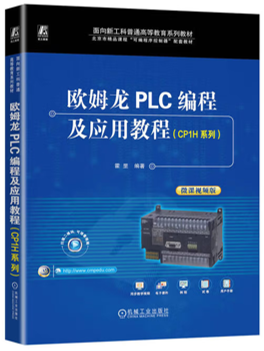

# Teaching

<!-- 添加顶部导航栏 -->

  <a href="index.html">Home</a> |
  <a href="Detailed profile.html">Detailed profile</a> |
  <a href="projects.html">Projects</a> |
  <a href="teaching.html">Teaching</a> |
  <a href="publications.html">Publications</a> |
  <a href="students.html">Students</a> |
  <a href="contact.html">Contact</a>

## 📘 Undergraduate Courses / 本科生课程

- **液压与气压传动**（专业必修课）  
  💡 *Hydraulic and Pneumatic Transmission*  
  📎 课件下载链接（每章完成课堂教学后更新）：   
  基础知识：[Ch1](pdf/Ch1.pdf)  
  液压部分：[Ch2](pdf/Ch2.pdf)｜[Ch3](pdf/Ch3.pdf)｜[Ch4](pdf/Ch4.pdf)｜[Ch5](pdf/Ch5.pdf)｜[Ch6](pdf/HP-Ch6.pdf)｜[Ch7](pdf/HP-Ch7.pdf)  
  气动部分：[Ch10](pdf/HP-Ch10.pdf)｜[Ch11](pdf/HP-Ch11.pdf)｜[Ch12](pdf/HP-Ch12.pdf)｜[Ch13](pdf/HP-Ch13.pdf)｜[Ch14](pdf/HP-Ch14.pdf)｜[Ch15](pdf/HP-Ch15.pdf) 
  📚 **教材**：*《液压与气压传动（第 3 版）》，游有鹏、李成刚主编，科学出版社*
  

  

---
  

- **机器人动力学与控制**（专业必修课）  
  💡 *Robot Dynamics and Control*  
  📎 课件下载链接（每章完成课堂教学后更新）：  
  动力学部分：[Ch1](pdf/Robot-Ch1.pdf)｜[Ch2](pdf/Robot-Ch2.pdf)｜[Ch3](pdf/Robot-Ch3.pdf)｜[Ch4](pdf/Robot-Ch4.pdf)  
  控制部分：[Ch5](pdf/Robot-Ch5.pdf)｜[Ch6](pdf/Robot-Ch6.pdf)｜[Ch7](pdf/Robot-Ch7.pdf)｜[Ch8](pdf/Robot-Ch8.pdf)｜[Ch9](pdf/Robot-Ch9.pdf)  

---

- **可编程控制器**（专业选修课）  
  💡 *Programmable Logic Controller (PLC)*  
  📎 课件下载链接（每章完成课堂教学后更新）：  
  <!-- [Ch1](pdf/PLCcn-Ch1.pdf)｜[Ch2](pdf/PLCcn-Ch2.pdf)｜[Ch3](pdf/PLCcn-Ch3.pdf)｜[Ch4](pdf/PLCcn-Ch4.pdf) -->  
  📚 **教材**：*《欧姆龙PLC编及程应用教程(CPIH系列)》，主编，机械工业出版社，2023年*
  

  

---

## 🌐 International Student Courses / 留学生课程

- **Programmable Logic Controller (PLC)**（Compulsory Module Course）    
  💡 *可编程控制器（核心模块课程）*  
  📎 **Download Link**（The corresponding chapter content will be updated after completing teaching.）：
  Lectures: [Ch1](pdf/PLCen-Ch1.pdf)｜[Ch2](pdf/PLCen-Ch2.pdf)｜[Ch3](pdf/PLCen-Ch3.pdf)｜[Ch4](pdf/PLCen-Ch4.pdf)   
  Experiment: [Experiment Guide](pdf/PLC-Experiment-Guide.pdf)｜[PLC-Experiment-Report-Temple](./pdf/PLC-Experiment-Report-Temple.docx)

---

## 🎓 Master's and Doctoral Courses 研究生课程

- **基于智能材料的机电系统：建模与控制**  
  *Modelling and Control of Smart Materials-based Mechatronic Systems*  
  🧭 *NUAA International Summer Course*  
  🤝 *Joint with [Prof. Micky Rakotondrabe](http://m.rakoton.net/) ([UTTOP](https://www.uttop.fr/en/index.html)), France*  

---

- **学术读写说技巧**  
  *Academic Reading, Writing and Presentation Skills*  
  🧭 *NUAA International Summer Course*  
  🤝 *Joint with [Prof. Micky Rakotondrabe](http://m.rakoton.net/) ([UTTOP](https://www.uttop.fr/en/index.html)), France*  

---

## 📚 Educational Reform Projects & Teaching Research / 教改课题与教改论文

### 🔬 教改课题 / Educational Reform Projects

- **工业和信息化部“十四五”教材建设基地课题**  
  *The "14th Five-Year Plan" Textbook Construction Base Project of the Ministry of Industry and Information Technology*  
  📌 航空航天领域智能制造科教产教融合企业案例与机电控制教材建设研究  
  💡 *Research on Case Studies of Intelligent Manufacturing in Aerospace Industry and Construction of Textbooks for Mechanical and Electrical Control*  
  ⏱️ 2024.06--2026.06 （主持）  

---

- **南京航空航天大学研究生教育教学改革项目**（项目编号：2020YJXGG20）  
  *Postgraduate Education Reform Project at NUAA*  
  📌 破“五唯”新形势下机械工程研究生创新能力培养的过程控制与分阶段评价机制研究  
  💡 *Process Control and Phased Evaluation Mechanism for Cultivating Innovation Ability of Graduate Students in Mechanical Engineering under the New Anti-"Five-Only" Policy*  
  ⏱️ 2020.12--2022.12 （主持，已结题）  

---

- **南京航空航天大学本科教育教学改革项目**（项目编号：2023JG0524Y）  
  *Undergraduate Education Reform Project at NUAA*  
  📌 “新工科”背景下医工融合创新项目式人才培养模式探索与实践  
  💡 *Exploration and Practice of Project-Based Innovative Training Model for Medical-Engineering Integration under the "New Engineering Disciplines" Initiative*  
  ⏱️ 2023.10--2025.10 （主持，已结题）  

---

### 📝 教改论文 / Educational Reform Papers

- **凌杰**, 朱玉川，王旦  
  📄 *破“五唯”新背景下机械工程研究生创新能力培养*  
  💡 *Innovative Ability Cultivation of Mechanical Engineering Graduate Students in the Context of Breaking the "Five-Only" Norms*  
  📰 《科教导刊》，2022年第6期，pp. 45–47  

---

- **凌杰**, 王旦，朱玉川  
  📄 *医工融合创新项目式人才培养模式探索*  
  💡 *Exploration of Project-Based Training Model for Integrating Medicine and Engineering Innovation*  
  📰 《中国教育技术装备》，录用待发表  

---

## Supervised Undergraduate Thesis / 指导本科毕设
- 2025年5月，张振熙，多腿协调驱动的压电执行器结构设计与优化分析
- 2025年5月，陶子牛，球形粘滑压电执行器结构设计与优化分析
- 2025年5月，李林瀚，肺病变活检用支气管镜机器人结构设计与运动学分析
- 2025年5月，周顺，基于格子-玻尔兹曼法计算平推流中球形颗粒所受的流体动力
- 2024年5月，玉作庆，身体固定式腰麻穿刺机器人软硬件系统设计
- 2024年5月，马士钦，经支气管细针抽吸柔性机器人结构设计与运动学分析
- 2024年5月，屠羿君，深部肺检查柔性机器人结构设计和运动学分析
- 2024年5月，林丰宁（留学生），Precision motion tracking of piezoelectric actuated systems using iterative learning control
- 2024年5月，简洁（留学生），Data-driven PID control design for piezoelectric actuated stage with parameter uncertainty
- 2023年5月，艾北林，基于三维镂空柔顺机构的线性压电驱动器设计与性能仿真
- 2023年5月，张国栋，强机电耦合压电俘能器的结构设计与性能分析
- 2023年5月，张子洋，双向高速尺蠖式压电马达的结构设计与性能仿真
- 2023年5月，王天佐，视网膜下注射手术机器人运动机构设计与仿真分析
- 2022年5月，段榆洲，机器人辅助麻醉穿刺系统设计与精稳进针控制
- 2022年5月，吕鹏，串并联混合式眼内手术器结构设计与运动/力学分析
- 2022年5月，李昌汭，外科手术用远程运动中心机构设计与运动学/力学分析
- 2022年5月，吴卓远，基于对称三角驱动机构的尺蠖旋转压电马达设计与分析
- 2021年5月，张正晗，二自由度解耦的压电微夹钳结构设计与性能仿真
- 2021年5月，刘鹏坤，基于压电振动的细胞切割操作针结构设计与性能分析
- 2021年5月，虞钧鹏，针对卵母细胞穿刺和注射的压电末端执行器结构设计与性能分析
- 2021年5月，王晋华，基于变刚度调谐的压电俘能器结构设计与性能分析  

---

