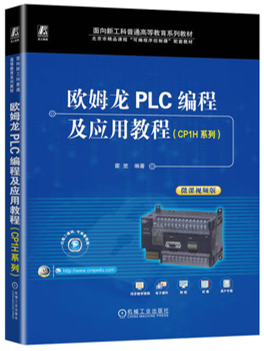

# Teaching

<!-- 添加顶部导航栏 -->

  <a href="index.html">Home</a> |
  <a href="Detailed profile.html">Detailed profile</a> |
  <a href="projects.html">Projects</a> |
  <a href="teaching.html">Teaching</a> |
  <a href="publications.html">Publications</a> |
  <a href="students.html">Students</a> |
  <a href="contact.html">Contact</a>

## 📘 Undergraduate Courses / 本科生课程

- **液压与气压传动**（专业必修课）  
  💡 *Hydraulic and Pneumatic Transmission*  
  📎 课件下载链接（每章完成课堂教学后更新）：   
  <!-- 基础知识：[Ch1](pdf/Ch1.pdf) -->   
  <!-- 液压部分：[Ch2](pdf/Ch2.pdf)｜[Ch3](pdf/Ch3.pdf)｜[Ch4](pdf/Ch4.pdf)｜[Ch5](pdf/Ch5.pdf)｜[Ch6](pdf/HP-Ch6.pdf)｜[Ch7](pdf/HP-Ch7.pdf) -->    
  <!-- 气动部分：[Ch10](pdf/HP-Ch10.pdf)｜[Ch11](pdf/HP-Ch11.pdf)｜[Ch12](pdf/HP-Ch12.pdf)｜[Ch13](pdf/HP-Ch13.pdf)｜[Ch14](pdf/HP-Ch14.pdf)｜[Ch15](pdf/HP-Ch15.pdf) -->      
  📚 **教材**：*《液压与气压传动（第 3 版）》，游有鹏、李成刚主编，科学出版社*
  

  

---
  

- **机器人动力学与控制**（专业必修课）  
  💡 *Robot Dynamics and Control*  
  📎 课件下载链接（每章完成课堂教学后更新）：  
  <!-- 动力学部分：[Ch1](pdf/Robot-Ch1.pdf)｜[Ch2](pdf/Robot-Ch2.pdf)｜[Ch3](pdf/Robot-Ch3.pdf)｜[Ch4](pdf/Robot-Ch4.pdf) -->   
  <!-- 控制部分：[Ch5](pdf/Robot-Ch5.pdf)｜[Ch6](pdf/Robot-Ch6.pdf)｜[Ch7](pdf/Robot-Ch7.pdf)｜[Ch8](pdf/Robot-Ch8.pdf)｜[Ch9](pdf/Robot-Ch9.pdf) -->     

---

- **可编程控制器**（专业选修课）  
  💡 *Programmable Logic Controller (PLC)*  
  📎 课件下载链接（每章完成课堂教学后更新）：  
  [Ch1](pdf/PLCcn-Ch1.pdf)｜[Ch2](pdf/PLCcn-Ch2.pdf)｜[Ch3](pdf/PLCcn-Ch3.pdf)｜[Ch5](pdf/PLCcn-Ch5.pdf)       
  📚 **教材**：*《欧姆龙PLC编及程应用教程(CPIH系列)》，霍罡 主编，机械工业出版社，2023年*  
  

  

---

## 🌐 International Student Courses / 留学生课程

- **Programmable Logic Controller (PLC)**（Compulsory Module Course）    
  💡 *可编程控制器（核心模块课程）*  
  📎 **Download Link**（The corresponding chapter content will be updated after completing teaching.）：
  <!-- Lectures: [Ch1](pdf/PLCen-Ch1.pdf)｜[Ch2](pdf/PLCen-Ch2.pdf)｜[Ch3](pdf/PLCen-Ch3.pdf)｜[Ch4](pdf/PLCen-Ch4.pdf) -->    
  <!-- Experiment: [Experiment Guide](pdf/PLC-Experiment-Guide.pdf)｜[PLC-Experiment-Report-Temple](./pdf/PLC-Experiment-Report-Temple.docx) -->  

---

## 🎓 Master's and Doctoral Courses 研究生课程

- **基于智能材料的机电系统：建模与控制**  
  *Modelling and Control of Smart Materials-based Mechatronic Systems*  
  🧭 *NUAA International Summer Course*  
  🤝 *Joint with [Prof. Micky Rakotondrabe](http://m.rakoton.net/) ([UTTOP](https://www.uttop.fr/en/index.html)), France*  

---

- **学术读写说技巧**  
  *Academic Reading, Writing and Presentation Skills*  
  🧭 *NUAA International Summer Course*  
  🤝 *Joint with [Prof. Micky Rakotondrabe](http://m.rakoton.net/) ([UTTOP](https://www.uttop.fr/en/index.html)), France*  

---

## Supervised Student Competitions, Contests, Research Programs and The Student Prizes, Honors, Awards

### Undergraduate Innovation Training Program / 大学生创新训练计划项目
- 2021年，基于压电振动调制的细胞微注射系统设计，国家级，段榆洲、田佳淳、王忠尉、张允执、张梦昊，考核良好  
- 2022年，机器人辅助穿刺麻醉进针机构设计与运动控制，校级，邢宇、吴志雨、薛宇航、周延，通过  
- 2023年，视网膜下穿刺注射手术机器人系统设计，校级，曹振强、曾香云、周顺，良好  
- 2023年，机器人辅助穿刺麻醉进针机构与运动控制系统设计，校级，曹壮、关一鸣、付江、史赟琦，优秀  
- 2023年，强机电耦合减振俘能器的结构设计与性能分析，校级，陈婷栩、陈盛凯、朱梓伊，通过  
- 2024年，椎管内麻醉穿刺定位机构设计与组织感知，校级，贾文博、黄文卓、王腾、赵宝华，良好
- 2026年，蛇骨型支气管镜机器人结构创新设计与分析，校级，周绍天、蒋子豪
-	2026年，经口喉手术机器人建模分析与运动控制，校级，舒涵、刘奕菲、安舒欣
-	2026年，末端可伸展支气管镜机器人设计与控制，校级，朱天义、魏浩天、阮旭天  

### Undergraduate Free Exploration Program / 本科生自由探索计划项目
- 2022年，细胞切割微操作针结构设计，黎天昊、李邦序、宁心、秦一炜  
- 2022年，位姿自适应智能弹药结构设计，姜雨辰、吴俊阳、姚皓博、宋汶龙  
- 2022年，仿蝙蝠扑翼无人机的原理设计，高华、魏佳旭、黄泽毅、周顺
- 2026年，人工智能在支气管镜手术机器人的应用及发展趋势，王庭萱、张诗宁、叶家齐、万爱萌
-	2026年，支气管镜手术机器人系统的机械结构创新与临床转化应用现状调研，沈舒笑、黄天泽
-	2026年，经口喉手术用可伸展连续体机器人设计与控制，舒涵、刘奕菲、安舒欣
-	2026年，超声检查设备机构创新设计与医学图像分析应用探索，蔡哲宇、章清阳、王培林、张郑新
-	2026年，支气管镜手术机器人临床应用与术中导航技术调研，阮旭天、魏浩天、朱天义  

### University Students' Robot Competition / 大学生机器人竞赛
- 2022年，第五届中国高校智能机器人创意大赛江苏区域赛，二等奖，廖之峰、皮俊杰、夏凌峰  
- 2022年，第五届中国高校智能机器人创意大赛江苏区域赛，二等奖，段榆洲、张允执、张梦昊
- 2026年8月，十一届全国大学生生物医学工程创新设计大赛，二等奖，面向肺外周结节活检的软体支气管镜机器人系统，玉作庆、段榆洲、康绍帅、李龙宇 

### Undergraduate Academic Forum / 本科生学术论坛
- 2021年，第十二届本科生学术论坛一等奖、季军，段榆洲  
- 2024年，第十五届本科生学术论坛一等奖，贾文博  

### Undergraduate Graduation Project / 本科生毕业设计
- 2024年，校优秀本科毕业设计二等奖，身体固定式腰麻穿刺机器人软硬件系统设计，玉作庆  
- 2022年，校优秀本科毕业设计一等奖，机器人辅助穿刺麻醉进针机构与运动控制系统设计，段榆洲  

### National Undergraduate Graduation Project Competition / 全国毕设大赛
- 2024年，第七届精雕杯毕业设计大赛东部赛区二等奖，身体固定式腰麻穿刺机器人软硬件系统设计，玉作庆
- 2026年，第九届精雕杯毕业设计大赛东部赛区二等奖，高速传动系统动部件润滑试验台设计与搅油损失特性分析，黄文卓  

### Postgraduate Research Fund Project / 研究生科研基金项目
- 2023年，研究生创新实验竞赛，面向椎管内麻醉的机器人辅助针穿刺系统，段榆洲、张允执、彭洪涛、张国栋  
- 2024年，江苏省研究生科研与实践创新计划项目，面向肺外周活检的软连续体支气管镜机器人系统研究，段榆洲  
- 2025年，博士学位论文创新与创优基金项目，面向肺外周支气管镜活检的可伸展软连续体机器人研究，段榆洲

### Outstanding Master's Thesis / 优秀硕士学位论文
-	2026年，校优秀学术学位硕士学位，分布式压电叠堆执行器设计与控制研究，张允执  

---

## 📚 Educational Reform Projects & Teaching Research / 教改课题与教改论文

### 🔬 教改课题 / Educational Reform Projects

- **工业和信息化部“十四五”教材建设基地课题**  
  *The "14th Five-Year Plan" Textbook Construction Base Project of the Ministry of Industry and Information Technology*  
  📌 航空航天领域智能制造科教产教融合企业案例与机电控制教材建设研究  
  💡 *Research on Case Studies of Intelligent Manufacturing in Aerospace Industry and Construction of Textbooks for Mechanical and Electrical Control*  
  ⏱️ 2024.06--2026.06 （主持）  

---

- **南京航空航天大学研究生教育教学改革项目**（项目编号：2020YJXGG20）  
  *Postgraduate Education Reform Project at NUAA*  
  📌 破“五唯”新形势下机械工程研究生创新能力培养的过程控制与分阶段评价机制研究  
  💡 *Process Control and Phased Evaluation Mechanism for Cultivating Innovation Ability of Graduate Students in Mechanical Engineering under the New Anti-"Five-Only" Policy*  
  ⏱️ 2020.12--2022.12 （主持，已结题）  

---

- **南京航空航天大学本科教育教学改革项目**（项目编号：2023JG0524Y）  
  *Undergraduate Education Reform Project at NUAA*  
  📌 “新工科”背景下医工融合创新项目式人才培养模式探索与实践  
  💡 *Exploration and Practice of Project-Based Innovative Training Model for Medical-Engineering Integration under the "New Engineering Disciplines" Initiative*  
  ⏱️ 2023.10--2025.10 （主持，已结题）  

---

### 📝 教改论文 / Educational Reform Papers

- **凌杰**, 朱玉川，王旦  
  📄 *破“五唯”新背景下机械工程研究生创新能力培养*  
  💡 *Innovative Ability Cultivation of Mechanical Engineering Graduate Students in the Context of Breaking the "Five-Only" Norms*  
  📰 《科教导刊》，2022年第6期，pp. 45–47  

---

- **凌杰**, 王旦，朱玉川  
  📄 *医工融合创新项目式人才培养模式探索*  
  💡 *Exploration of Project-Based Training Model for Integrating Medicine and Engineering Innovation*  
  📰 《中国教育技术装备》，录用待发表  

---

## Supervised Undergraduate Thesis / 指导本科毕设
- 2026年5月，黄文卓，高速传动系统动部件润滑试验台设计与搅油损失特性分析（第九届“精雕杯”毕设大赛东部赛区二等奖）
- 2026年5月，陈灿，乳腺检测软体机器人结构设计与运动学分析
- 2026年5月，陈镜宇，末端可伸展支气管镜机器人结构设计与仿真分析
- 2025年5月，张振熙，多腿协调驱动的压电执行器结构设计与优化分析
- 2025年5月，陶子牛，球形粘滑压电执行器结构设计与优化分析
- 2025年5月，李林瀚，肺病变活检用支气管镜机器人结构设计与运动学分析
- 2025年5月，周顺，基于格子-玻尔兹曼法计算平推流中球形颗粒所受的流体动力
- 2024年5月，玉作庆，身体固定式腰麻穿刺机器人软硬件系统设计（第七届“精雕杯”毕设大赛东部赛区二等奖，校优秀本科毕业设计二等奖）
- 2024年5月，马士钦，经支气管细针抽吸柔性机器人结构设计与运动学分析
- 2024年5月，屠羿君，深部肺检查柔性机器人结构设计和运动学分析
- 2024年5月，林丰宁（留学生），Precision motion tracking of piezoelectric actuated systems using iterative learning control
- 2024年5月，简洁（留学生），Data-driven PID control design for piezoelectric actuated stage with parameter uncertainty
- 2023年5月，艾北林，基于三维镂空柔顺机构的线性压电驱动器设计与性能仿真
- 2023年5月，张国栋，强机电耦合压电俘能器的结构设计与性能分析
- 2023年5月，张子洋，双向高速尺蠖式压电马达的结构设计与性能仿真
- 2023年5月，王天佐，视网膜下注射手术机器人运动机构设计与仿真分析
- 2022年5月，段榆洲，机器人辅助麻醉穿刺系统设计与精稳进针控制（校优秀本科毕业设计一等奖）
- 2022年5月，吕鹏，串并联混合式眼内手术器结构设计与运动/力学分析
- 2022年5月，李昌汭，外科手术用远程运动中心机构设计与运动学/力学分析
- 2022年5月，吴卓远，基于对称三角驱动机构的尺蠖旋转压电马达设计与分析
- 2021年5月，张正晗，二自由度解耦的压电微夹钳结构设计与性能仿真
- 2021年5月，刘鹏坤，基于压电振动的细胞切割操作针结构设计与性能分析
- 2021年5月，虞钧鹏，针对卵母细胞穿刺和注射的压电末端执行器结构设计与性能分析
- 2021年5月，王晋华，基于变刚度调谐的压电俘能器结构设计与性能分析  

---

